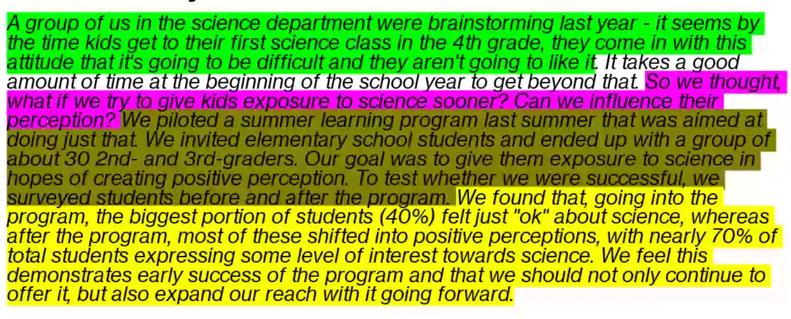

# How to Tell Stories With Data - **WEEK #1**

> **CLASS OBJECTIVE:**
>
> * Make you better at presenting data
> * In a world of unlimited data, those who can explain have the power
> * Technical learning can take over, but learning proficiency skills is just as important

## Chapter 1: The Importance of Context

### Explanatory VS Exploratory Analysis

* *Exploratory: searching a wide array of factors looking for an insight*
* **Explanatory: Analyzing and explaining a very specific thing, usually 1-3 insights**

### Who, What, How

* **WHAT**
    * What action/insight do you want your audience to take away?
    * *3-Minute Story:* setting the scene (green), hypothesis (pink), experiment/analysis (dark yellow), results (light yellow)
    * *The Big Idea:* taking your 3-minute story and compress it down to one sentence
        * must articulate UNIQUE point of view
        * convey what is as stake
        * must be a complete sentence

> **My Example 3-Minute Story:** Here on the analytics team, we have seen that reducing the cut that Schmoogle takes for developers putting their app on the app store in exchange for letting developers use their own payment system will actually drive more revenue for Schmoogle. This seems counter-intuitive because we are taking less of a cut which we would think would cause us to take less revenue overall. As such, we decided to investigate what would happen if we took a 15% cut of revenue from developer apps instead of 30%. We launched a beta app store that would allow developers to use their own payment methods in exchange for a smaller cut. When we launched this option in beta, we noticed that the number of apps that were introduced to the Mandroid platform increased by 150%. In return, the more apps that we have on our platform, the more revenue in turn that we will end up generating for our company. We feel this demonstrates the success of this shifted business model and that we should adjust the Mandroid app store to adapt this model for Schmoogle.

* **WHO**
    * Keep in mind who you are presenting you - are they higher/lower than you in the company and are their technical skills greater/worse than yours?
    * Aggregating up doesn't mean you can't have details at all times
      * People higher up will eventually have follow-up questions that are asking for details, they just ask it from a business perspective
    * You can also remove intricacies as you are presenting down so that younger professionals are not so overwhelmed on the job

## Chapter 2: Choosing an Effective Visual

### Simple Text

* Communicates point more effectively if there is very little data to communicate
* Use colors/font size to draw the attention more efficiently than graphs

### Tables

* Great for diverse audiences as people just find the parts most important to them
* rarely good for live audiences
* the less visible your borders, the more that your data actually stands out

### Heatmaps

* Tables that are colored to bring the attention to certain areas in the table
* Use saturation to bring more attention to certain parts of the table

### Scatterplots

*  Used to communicate the relationship between two features

### Line Graphs

* showed that data is continuous because the data is physically connected (e.g. data over time)

### Bar Charts

* common chart so easy for audiences to understand
* you need to start at 0 (absolute minimum)
* make sure that your y-axis is on the left side of the graph because people read from left to right
* make sure that your bars are of the correct thickness to increase the readability of your chart
* be careful to reduce the number of series that you are comparing in your bar chart
  * 3+ really reduces readability
* you can also do a stacked vertical bar chart, but it's really hard to showcase series in this case
  * supposed to be used to compare totals against each other while also providing the subcategories
    * put the subcategories that you want to emphasize on the bottom
* Should use horizontal over vertical bar charts because we read top -> bottom and left->right

### Waterfall Charts

* Slope graph that has been pulled apart
* Start with a beginning/ending value, and the waterfall chart shows the differences that occur to get to the ending value
* Used in ML because it's important to show which factors in your ML model were the most important
* Can also eliminate the first bar to show how you get to the end over time

### Area Chart (Treemap)

* Humans do a terrible job of telling apart the differences in area so these charts should be avoided
* Comparing on more than one dimension makes it harder to compare because our focus then gets drawn to another dimension
* if categories have vastly different magnitudes, then this type of chart would make sense to use

### Don'ts of Chartmaking

* Avoid Pie Charts
* Avoid 3D Charts
* Avoid Dual Axis Charts
  * Instead label points directly
  * Make sure to pull the labels apart vertically

## Chapter 3 - Getting Rid of Clutter

### Gestalt Principles of Visual Perception

* Every item you add to a visual will further add to clutter and add to cognitive load
* **Clutter:** visual elements that contribute to cognitive load without increasing understanding
* *Proximity:* putting things close together causes us to think that these things in proximity are related to each other
* *Closure:* Borders don't add anything useful
* *Continuity:* we assume things are continuous unless other info is provided
* *Connection:* We assume that connected items are a part of the same group and this is the strongest way to show connection in data

### Three Types of Memory

* *Iconic:* super short-term memory that helps us notice changes in things we look at and notice movement
* *Short-Term:* people can store roughly 4 chunks of info at a time. Can use this to limit number of series, colors, and shapes in our visuals.
* *Long-Term:* 
* Pre-attentive attribute: a change in your environment that helps other people see trends and other important points in your visualizations
  * TL;DR - the different thing sticks out
* Use blue for good and orange for bad